- [Overview](#overview)
- [Installation](#installation)
- [Usage](#usage)
- [About](#about)


## Overview



**hashdir** is a simple command-line tool to checksum directories and files.

A [checksum](https://en.wikipedia.org/wiki/Checksum) is a short sequence of letters and numbers derived from another (often larger) sequence of data. Checksums are created from input data using a hashing algorithm. For a good hashing algorithm, it is extremely difficult to come up with an input that results in a specific checksum. Therefore a checksum acts like a digital fingerprint - _if the checksums match we can be reasonably sure the input data matches_.

This is useful in many situations:
- **Transferring files** - compare checksums to ensure nothing was corrupted or tampered
- **Archiving data** - storing the checksum along with the data allows you to verify that your USB/hard drive/cloud provider didn’t modify your data
- **Duplicate detection** - check if you have duplicate files or directories and know what is safe to delete


## Installation
There are several ways to install hashdir, and they are listed below roughly in order of convenience. You can choose the method that fits your needs. The latest release can always be found at <https://github.com/ultimateanu/hashdir/releases>.

### Stand-alone binary
This is a single executable file with no external dependencies. It is available for various operating systems (e.g. macOS, Windows, Linux). This method is very simple but the stand-alone binaries are quite large since they bundle in the necessary dotnet runtime.
1. Download the latest version for your OS from [releases](https://github.com/ultimateanu/hashdir/releases)
2. Extract the contents of the .zip or .tar.gz file
3. Run the binary
```
hashdir --help
```
4. _Optional_: copy the executable to a directory in your PATH (e.g. /usr/local/bin)

### Package manager
hashdir is available via package managers. If you already have a package manager, this allows for easy installation and upgrades.

* Homebrew\*
```
brew install ultimateanu/software/hashdir
brew upgrade ultimateanu/software/hashdir
```

* dotnet (NuGet)
```
dotnet tool install --global hashdir
dotnet tool update --global hashdir
```

\*_Homebrew currently requires a project to have 50 stars to be included in core. So I've set up a custom tap for now that still allows easy installation. If you like this project, please consider starring on Github and adding a formula to Homebrew core eventually._

### Cross-platform dotnet app
If you already have the dotnet runtime on your machine, you can use the dotnet application which is a cross-platform solution. Since this relies on the dotnet platform for your system, the resulting size is significantly smaller.
1. Download the hashdir_x.y.z_dotnet zip or tar.gz file from [releases](https://github.com/ultimateanu/hashdir/releases)
2. Extract the contents of the .zip or .tar.gz file
3. Run the app  
```
dotnet hashdir.dll --help
```

### Build from source
Since this is an open-source project you can also build from source! This requires [dotnet 5](https://dotnet.microsoft.com).
1. Download the source code from the main branch on [GitHub](https://github.com/ultimateanu/hashdir/tree/main)
2. _Optional_: Build and run the app
```
dotnet run --project src/App/App.fsproj -- --help    
```
3. Publish a release version
```
dotnet publish -c Release src/App/App.fsproj 
```
4. Run the app
```
dotnet src/App/bin/Release/net5.0/publish/hashdir.dll --help
```


## Usage
```
hashdir:
  A command-line utility to checksum directories and files.

Usage:
  hashdir [options] [<item>...] [command]

Arguments:
  <item>    Directory or file to hash/check

Options:
  -t, --tree                                         Print directory tree
  -s, --save                                         Save the checksum to a file
  -i, --include-hidden-files                         Include hidden files
  -e, --skip-empty-dir                               Skip empty directories
  -a, --algorithm <md5|sha1|sha256|sha384|sha512>    The hash function to use [default: sha1]
  --version                                          Show version information
  -?, -h, --help                                     Show help and usage information

Commands:
  check <item>    Verify that the specified hash file is valid.
```

### Examples
1. Get the checksum of a file or directory.
```
hashdir ~/Desktop/project/
```
2. Get the checksum of a directory with the hidden files. Print out all subdirectories and files (tree).
```
hashdir --include-hidden-files --tree ~/Desktop/project 
```
3. Get the MD5 checksum of multiple items.
```
hashdir -a md5 song.mp3 info.txt report.pdf
```


## About
hashdir is an open-source project with a permissive [MIT License](https://github.com/ultimateanu/hashdir/blob/main/LICENSE). If you find a bug or have suggestions feel free to create an [issue](https://github.com/ultimateanu/hashdir/issues) on Github. Any contributions to the code, tests, or documentation are also welcome via a pull request.
